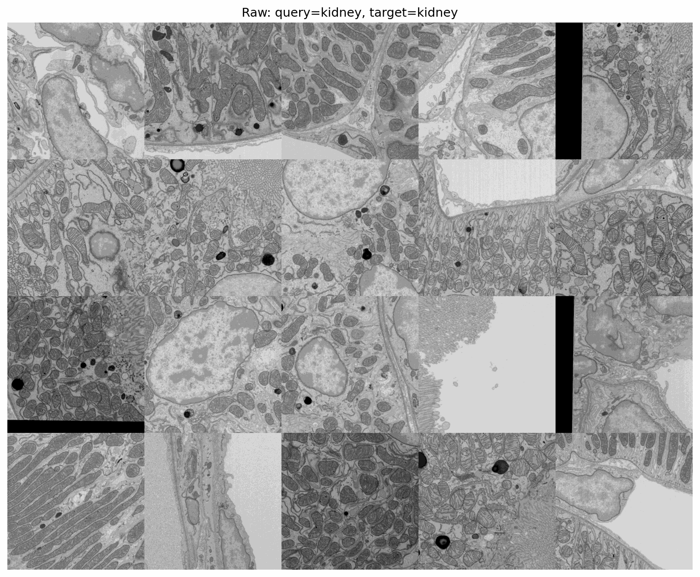
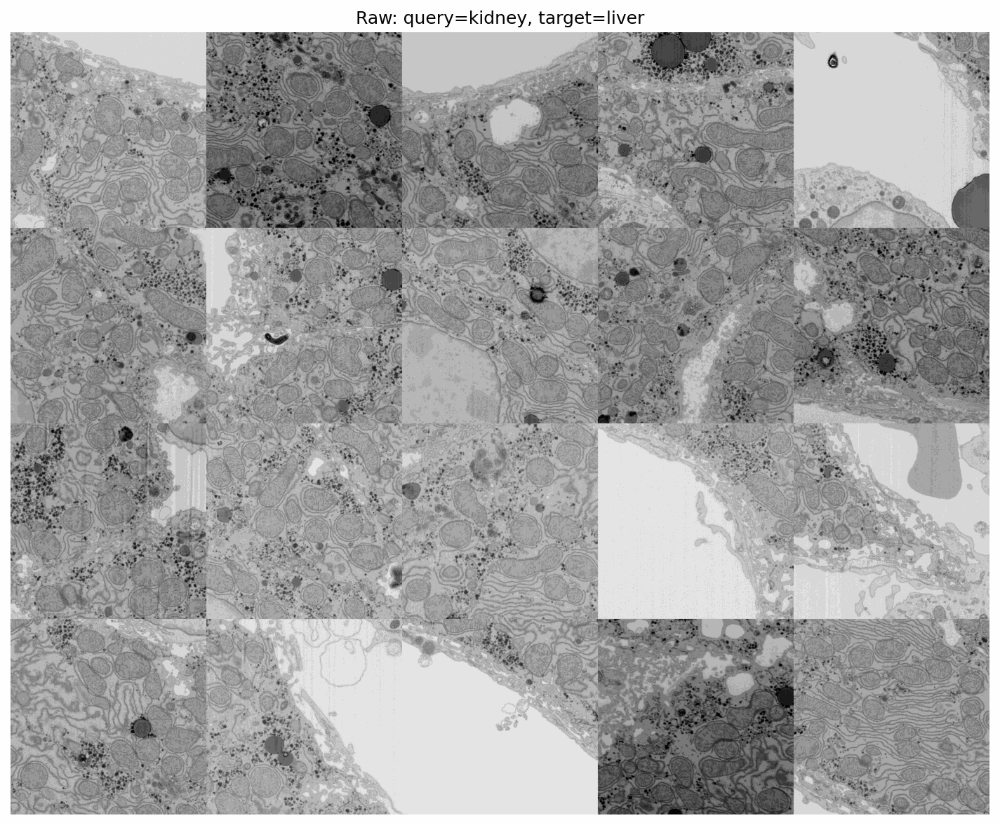

# Microscopy Image Analysis with DINOv3

Embedding-based mitochondria retrieval on OpenOrganelle EM data using a pretrained DINOv3 vision transformer.

## Setup

```bash
# Create a virtual environment and install dependencies
uv venv .venv
source .venv/bin/activate
uv pip install -r requirements.txt

# Clone DINOv3 (needed for model loading)
git clone https://github.com/facebookresearch/dinov3.git ../dinov3

# Download model weights
mkdir -p dinoweights
cd dinoweights
# Download dinov3_vits16 weights from the DINOv3 model zoo (see dino-weights.md for URLs)
cd ..
```

## Running

Start an IPython session:

```bash
ipython
```

### Task 1 -- Data Acquisition

Download 20 random 1024x1024 crops at full resolution (s0) from the
`jrc_mus-liver` and `jrc_mus-kidney` OpenOrganelle datasets.
All downloads are programmatic via the zarr/S3 API.

```python
from main import *
task1()
```

This saves crops to `cache/task1_liver/` and `cache/task1_kidney/`.
Subsequent runs skip already-downloaded files.

Browse the downloaded images in napari:

```python
import napari
w = napari.viewer.Viewer()
show_datasets(w)
```

### Task 2 -- Feature Extraction with DINOv3

Compute dense DINOv3 embeddings for both datasets using translated passes
at the model's native stride=16. Visualize the first 3 PCA components as
RGB overlays. Per-image mean subtraction removes inter-image bias before
joint PCA so that colors are consistent across the batch.

```python
import napari
w = napari.viewer.Viewer()
task2(w, stride=2, downsample_factor=2, n_images=4, dense=True, subtract_pos=True)
```

Parameters:
- `stride`: effective dense stride (must divide 16). Smaller = denser but slower.
- `downsample_factor`: downscale images before inference (2 = half resolution).
- `n_images`: how many images per dataset to process.
- `dense=True`: use translated-passes approach (recommended over stride hacking).
- `subtract_pos`: subtract positional baseline to reduce RoPE artifacts.

### Task 3 -- Embedding-Based Retrieval

Select mitochondria query points and retrieve similar regions across images.
Cosine similarity maps are computed per-query and averaged, then displayed
as scrollable napari stacks.

```python
import napari
w = napari.viewer.Viewer()

# Within-dataset retrieval: kidney queries on kidney targets
task3(w, query_ds='kidney', target_ds='kidney',
      query_idxs=[0,1,2,3,4,5,6], n_targets=7,
      downsample_factor=2, dense_stride=2)

# Cross-dataset retrieval: kidney queries on liver targets
task3(w, query_ds='kidney', target_ds='liver',
      query_idxs=[0,1,2], n_targets=5,
      downsample_factor=2, dense_stride=2)
```

Parameters:
- `query_ds` / `target_ds`: `'liver'` or `'kidney'`.
- `query_idxs`: which annotated mito points to use (see `mitolocations()`).
- `n_targets`: number of target images to predict on.

To generate all four query/target combinations and save tiled grids:

```python
from main import task3_all
task3_all(dense_stride=2, downsample_factor=2, n_targets=4)
```

#### Within-dataset retrieval

Kidney query on kidney targets | Liver query on liver targets
:---: | :---:
 | 

#### Cross-dataset retrieval

Kidney query on liver targets | Liver query on kidney targets
:---: | :---:
 | 

### Run Everything

```python
from main import run_everything
run_everything()
```

## Project Structure

```
main.py             Main script with all task functions
notes.md            Development notebook and observations
dino-weights.md     DINOv3 weight download URLs
cache/              Downloaded data and cached results
dinoweights/        DINOv3 model checkpoint
```
